# CoA Analytics

  <strong>Stop guessing. Start playing with answers.</strong>

  One in-game command center for performance, builds, gear, loot, battleground awareness, and weekly progression in Conquest of Azeroth.

  <a href="https://github.com/Tom75VN/CoAAnalytics/releases/latest/download/CoAAnalytics.zip"><strong>Download the latest complete release</strong></a>
  ·
  <a href="#installation">Installation</a>
  ·
  <a href="#private-by-design">Privacy</a>

---

## CoA does not lack possibilities. It lacks feedback.

Conquest of Azeroth gives you an extraordinary amount of freedom. That freedom also creates its biggest everyday pain point: **uncertainty**.

A new talent looks exciting—but is it really your best next point? An item has more green stats—but is it an upgrade for battlegrounds, dungeons, or neither? A player tops the damage meter—but did the healer stabilize the group, did the tank control the pull, and did the support actually create the win?

That uncertainty becomes wasted time, hesitant loot decisions, arguments after a bad run, and constant alt-tabbing between tools that never saw what happened to *your* character.

**CoA Analytics closes that gap.** It turns the data already available in your game into clear, role-aware decisions—while the moment still matters.

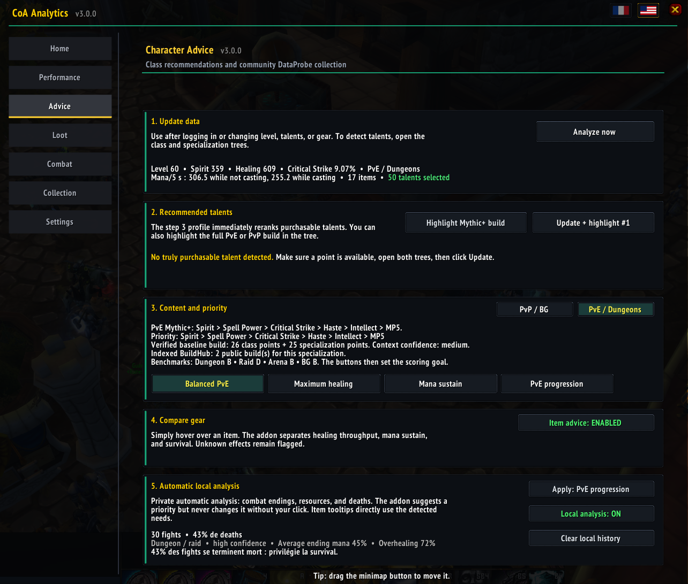

With CoA Analytics, you can:

- recognize roles and specializations before a battleground fight unfolds;
- understand performance without judging every player like a DPS;
- compare gear separately for PvP/BG and PvE/Dungeons;
- let your recent fights reveal whether you need more output, sustain, or survival;
- build personal rankings from the matches and runs your client actually observed;
- remove low-value loot clicks without ever giving up control of Need rolls;
- keep weekly Mythic progression visible instead of buried in another window.

The result is more than information. It is the quiet confidence of knowing *why* you are making a choice.

## See the battleground before it surprises you

### Know the role behind the nameplate

The enemy in front of you is not just a class color. CoA Analytics identifies observed CoA specializations and places **role and specialization icons directly on battleground nameplates**. Spot the healer, tank, or dangerous damage profile before committing your cooldowns.

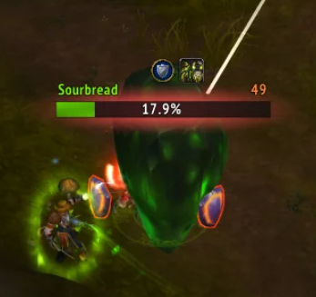

### Turn the scoreboard into a tactical debrief

The enhanced battleground scoreboard adds specialization names, levels, role icons, and top damage/healing recognition. Instead of scanning anonymous rows, you can immediately see which compositions and players shaped the match.

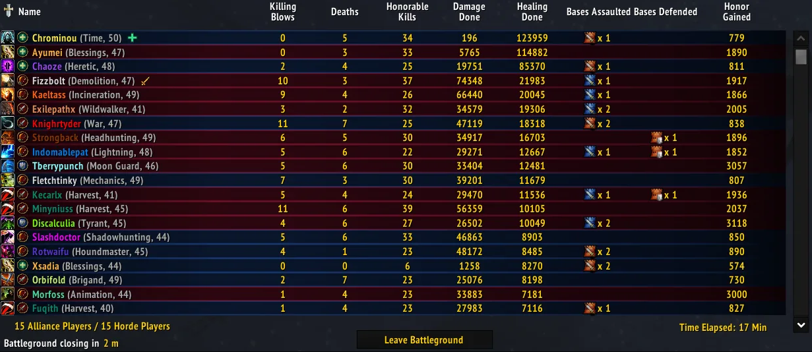

### Keep the whole raid—and the objective—in sight

The normal minimap can show members from the other raid subgroups plus live capture-flag markers. No more opening the full map just to understand where your team disappeared.

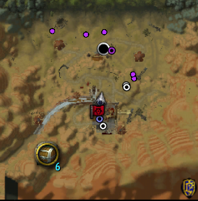

### Replace memory and hot takes with evidence

Every valid battleground your client observes can strengthen your own performance history. Specialization rankings account for participation and reduce the influence of heavily one-sided matches before stabilizing small samples. Player rankings separate damage, healing, tank, and support contexts, with visible consistency and confidence.

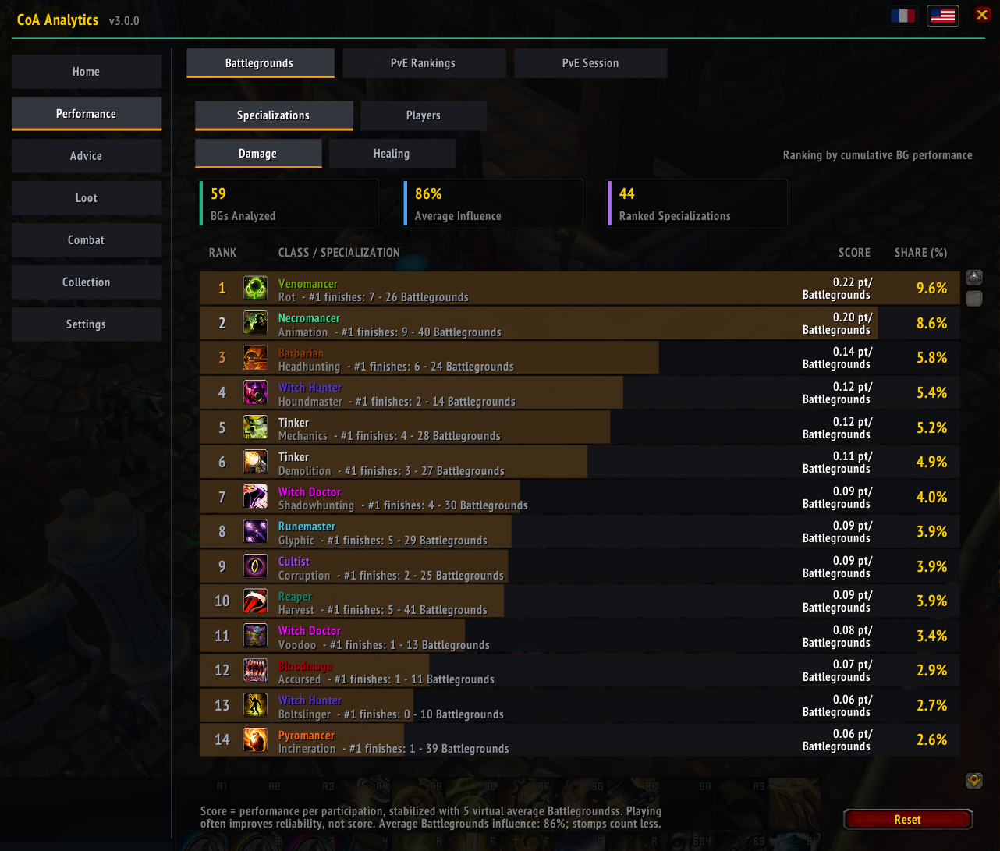

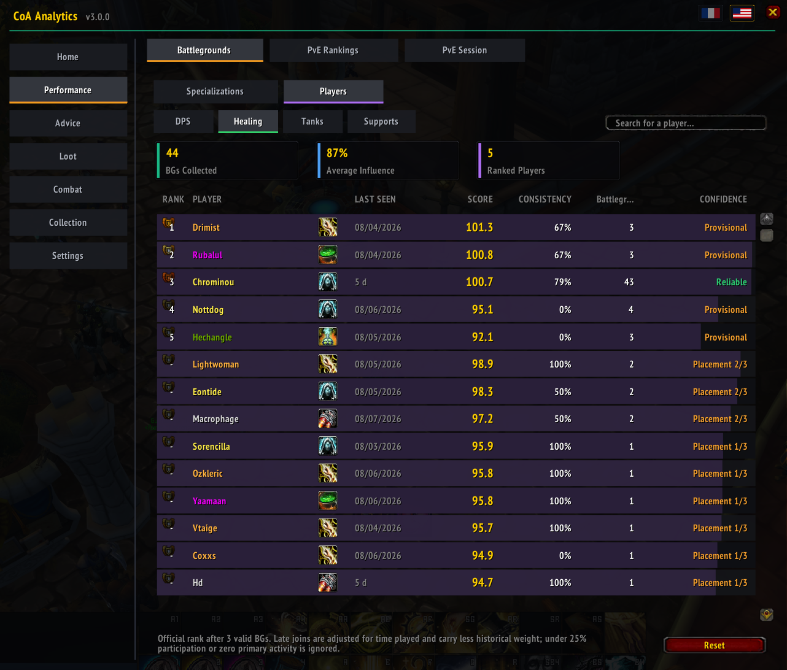

These are **local, cumulative rankings**, not an official or server-wide leaderboard. That is the point: they reflect the matches you actually experienced, while clearly exposing sample size and uncertainty.

## Stop grading every PvE role with a damage meter

A clean run is never only about damage. CoA Analytics evaluates each player for the job their role is expected to perform:

- **Damage:** meaningful boss and trash output, participation, survival, and measurable utility;
- **Healing:** health stability, urgent recovery, coverage, availability, mana management, absorbs, and utility—with overhealing kept deliberately low-impact;
- **Tank:** aggro control first, then resilience and survival, with contribution rewarded only after the core job is done;
- **Support:** measurable damage/healing contribution, availability, and client-visible utility.

The live dungeon overlay converts that analysis into an immediate **0–10 role rating**. A 7 represents expected performance for the role; higher scores reflect stronger performance in comparable conditions.

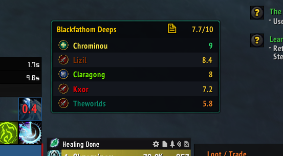

When the group wants a quick recap, share the same readable snapshot directly to party or raid chat.

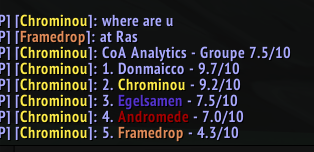

Completed dungeons and defeated raid bosses also feed local specialization rankings. A score of 100 represents average performance in a comparable context, and early samples are pulled toward that reference until enough evidence exists.

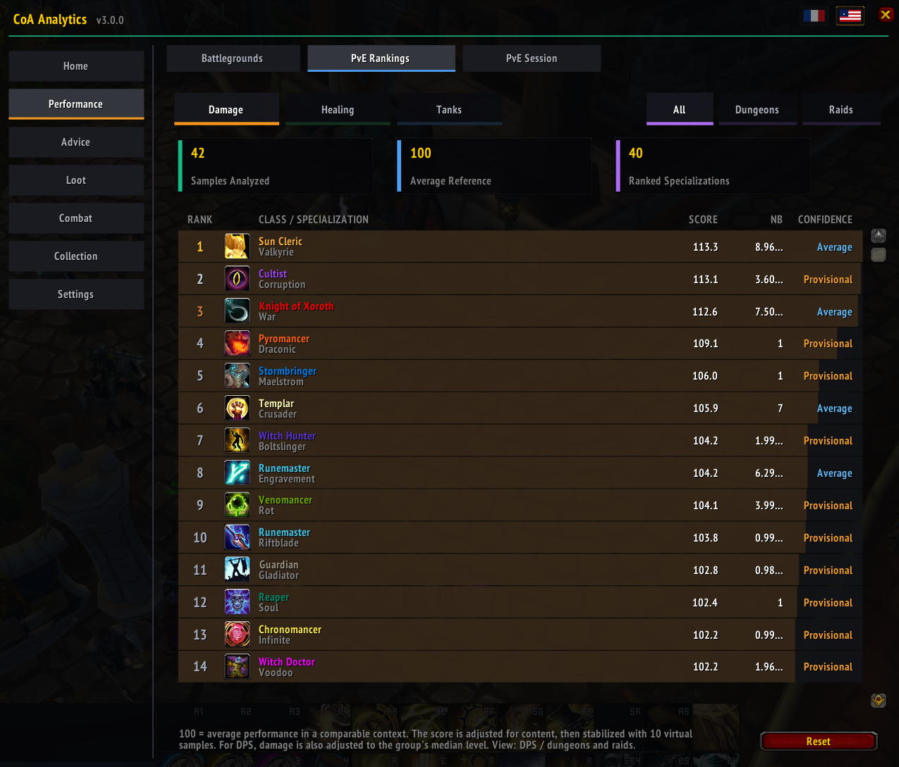

This gives good players something more useful than praise and struggling groups something better than blame: **a direction for the next run**.

## Make gear decisions for the content you actually play

An item can be an upgrade for one version of your character and a downgrade for another. CoA Analytics does not hide that tradeoff behind one generic green number.

Hover an item to compare it with the correct equipped slot. The Advisor evaluates **PvP/BG and PvE/Dungeons separately**, shows the suggested action, identifies the item it would replace, explains the important stat changes, and displays its confidence.

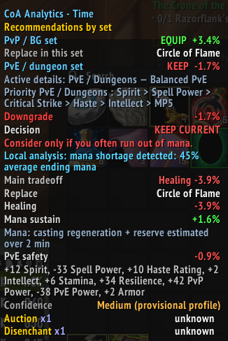

For deeper decisions, the tooltip separates throughput, sustain, survival, and profile-specific priorities. A tempting upgrade may still be rejected when it sacrifices the thing your recent gameplay proves you need.

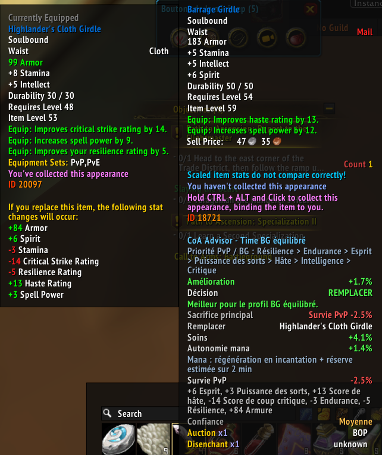

Unknown effects, provisional profiles, and cap-sensitive stats remain visibly flagged. General recommendations are priority comparisons—not invented DPS or healing percentages.

## Let your own gameplay improve the advice

Generic guides cannot know that *you* regularly finish pulls with 45% mana, spend too long at low health, or die before extra throughput can matter. The private local analyzer can.

For the current specialization and content type, it reviews up to 30 recent fights and looks at deaths, fight duration, health, resource pressure, ending mana, and role-relevant behavior. Once the sample is meaningful, it can suggest a better priority such as survival, sustain, or throughput.

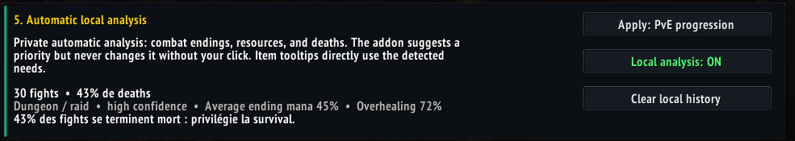

The addon **never changes that priority on its own**. You see the evidence, then choose whether to apply the suggestion. That small moment of control is what turns automation into trust.

## Spend talent points with a plan

The Advisor reads the visible Character Advancement trees and ranks talents that are actually purchasable, using the selected content and profile as context. It can highlight the next recommendation directly on the tree.

Chronomancer Time also includes the complete PvE/Mythic+ and PvP/BG build overlay shown below, turning a dense tree into a calm checklist of selected, recommended, and flexible points.

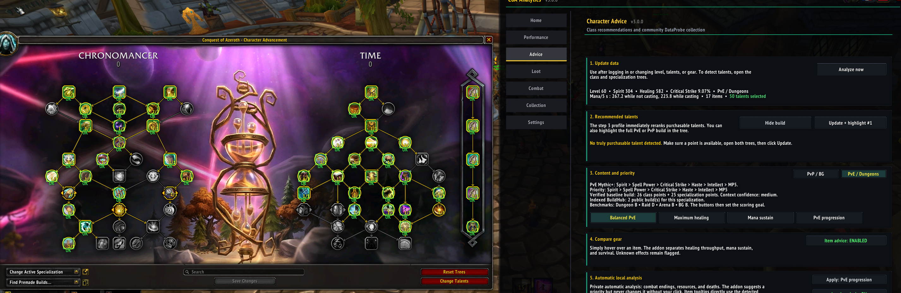

The bundled knowledge base covers 70 published CoA specialization guides and 70 validated public progression baselines. Public profiles are bundled snapshots rather than live web lookups, and one progression baseline does not pretend to replace every tournament or personal variant.

## Remove loot friction—not player control

When enabled, **Safe Auto-Greed** handles only decisions that have already been made safe:

- recognized crafting materials;
- confirmed incompatible gear;
- gear containing a stat you explicitly excluded for that character.

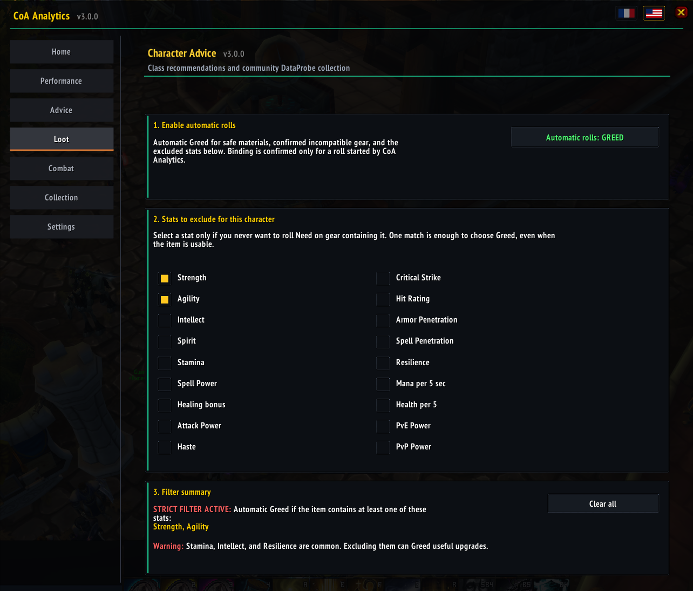

It never auto-Needs. Recognized keystones are protected, while recipes, quest items, consumables, and uncertain miscellaneous items stay manual. Stat exclusions are intentionally strict and clearly warn you when one match is enough to choose Greed.

You keep the meaningful decisions. The repetitive clicks disappear.

## Keep weekly progression one glance away

The minimap tooltip keeps the latest visible Edrim Mythic cache and Mythic Coin counters beside the next weekly cap increase. If the client exposes a direct weekly timer, the addon uses it; otherwise it clearly labels the raid-reset time as an estimate.

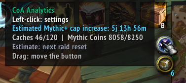

No spreadsheet. No mental arithmetic. No wondering whether you can still earn more this cycle.

## More quality of life, already built in

- **Mythic 0 route assistant:** identifies the Keystone final boss in recognized dungeons, shows published required objectives and mechanics, and can share the route in English. Legacy or unconfirmed routes stay labeled as such.
- **PvE death diagnostics:** optional per-death spell, aura, exact-threat, current-target, and aggro analysis for dungeon troubleshooting. Diagnostics are advisory and do not affect performance scores.
- **Capture-the-flag timer:** a 25-minute battleground countdown with urgent color changes near the end.
- **Chronomancer Time proc tracker:** dedicated visibility for Ideal Time and Through the Aeons timing.
- **One bilingual interface:** Home, Performance, Advice, Loot, Combat, Collection, and Settings in English or French.

## Private by design

CoA Analytics is useful without turning your play session into a background upload.

- Rankings, gameplay history, counters, and diagnostics remain in your local WoW SavedVariables.
- The optional `CoAAnalytics_DataProbe` collector is a separate load-on-demand addon and starts **OFF**.
- DataProbe never sends anything automatically. Export is a deliberate manual action.
- Character names are not part of the exported identity; combat GUIDs receive anonymous labels and detected tooltip creator names are removed.
- Community profiles bundled with a release are static snapshots rebuilt between versions from files players chose to submit.

## Honest by design

CoA Analytics helps you make better decisions; it does not pretend the WoW 3.3.5 client exposes perfect information.

- Rankings are comparative and local, not an official judgment of a player.
- Unresolved specializations and insufficient participation can be excluded rather than scored badly.
- Client-invisible support effects cannot all be measured.
- Unknown item effects remain marked for manual review.
- Talent and stat models show lower confidence when the evidence is provisional.
- A Mythic weekly reset is explicitly marked **Estimated** when no direct timer is available.

Clarity includes knowing where the data stops.

## Installation

1. [Download the latest complete release](https://github.com/Tom75VN/CoAAnalytics/releases/latest/download/CoAAnalytics.zip).
2. Extract the archive.
3. Move the `CoAAnalytics` folder into `Interface/AddOns`.
4. Optionally move `CoAAnalytics_DataProbe` beside it if you want to contribute data manually.
5. Restart the game and enable the addon on the character-selection screen.
6. Enter `/coaa` in chat.

The release archive always includes both folders. The main addon works without enabling DataProbe.

## Quick start

- `/coaa` — open the unified interface;
- `/coaa performance` — open BG/PvE rankings and the current PvE session;
- `/coaa advisor` — open character, talent, and gear advice;
- `/coaa loot` — configure Safe Auto-Greed;
- `/coaa combat` — inspect private local combat analysis;
- `/coaa collection` — view coverage or control the optional DataProbe;
- `/coaa minimap size 6-20` — change battleground raid-marker size;
- `/coaa boss` or `/coaa boss share` — inspect or share the recognized Mythic 0 route;
- `/coaa reset` — print the next Mythic+ cap increase and latest counters;
- `/coaa language en` or `/coaa language fr` — switch the interface language.

The minimap button is draggable. Left-click it to open CoA Analytics; hover it for Mythic counters and weekly status.

---

### Your build is unique. Your feedback should be useful.

Install CoA Analytics and replace the question **“Was that actually better?”** with an answer you can use before the next queue, pull, talent point, or loot roll.

**[Download CoA Analytics](https://github.com/Tom75VN/CoAAnalytics/releases/latest/download/CoAAnalytics.zip)**
